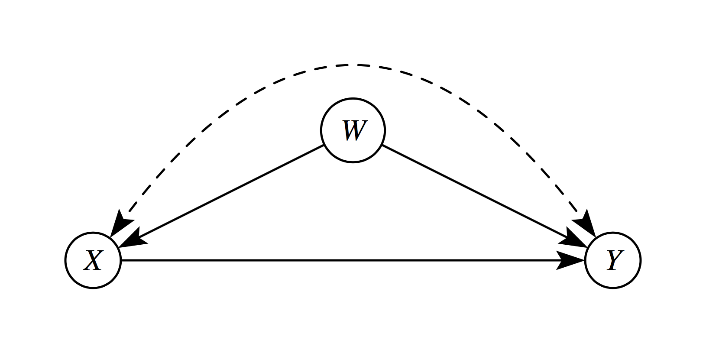
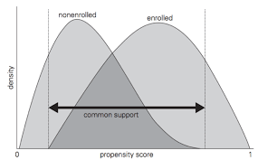

# Perfect Stratification 

Suppose that treated and untreated individuals differ substantially from each other, but that all systematic differences can be captured by a set of observed covariates $S$. This set $S$ includes all variables that jointly determine treatment assignment and potential outcomes.

Knowledge and observation of $S$ enable **perfect stratification** of the data. By "perfect," we mean that individuals within groups defined by values of $S$ are entirely indistinguishable from each other except for:

1. Observed treatment status
2. Differences in potential outcomes that are independent of treatment status

```{mermaid}
%%| fig-width: 8
%%| fig-align: center
flowchart LR
        subgraph S1["Stratum S1"]
            direction TB
            T1((T1))
            C1((C1))
            C2((C2))
        end

        subgraph S2["Stratum S2"]
            direction TB
            T2((T2))
            C3((C3))
            C4((C4))
        end

        subgraph S3["Stratum S3"]
            direction TB
            T3((T3))
            C5((C5))
            C6((C6))
        end

        classDef stratum fill:#f8f9fa,stroke:#1f4d4a,stroke-width:2px,color:#1f4d4a;
        classDef treat fill:#f7c948,stroke:#6b4f00,stroke-width:1.5px,color:#1f1f1f;
        classDef control fill:#d8f3dc,stroke:#2d6a4f,stroke-width:1.5px,color:#1f1f1f;

        style S1 fill:#f8f9fa,stroke:#1f4d4a,stroke-width:2px
        style S2 fill:#f8f9fa,stroke:#1f4d4a,stroke-width:2px
        style S3 fill:#f8f9fa,stroke:#1f4d4a,stroke-width:2px

        class T1,T2,T3 treat;
        class C1,C2,C3,C4,C5,C6 control;
```

In this Venn-style schematic, each circle represents a **perfectly stratified group**. Within each stratum, treated and control units are comparable on observed covariates $S$, so outcome differences can be attributed to treatment rather than observed confounding.

## Conditional Independence Assumptions

Under perfect stratification, we can assert the following assumptions:

**Assumption 1-S (Conditional Independence for $Y^1$):**
$$
E[Y^1 | D = 1, S] = E[Y^1 | D = 0, S]
$$


**Assumption 2-S (Conditional Independence for $Y^0$):**
$$
E[Y^0 | D = 1, S] = E[Y^0 | D = 0, S]
$$

Assumption 1-S and 2-S asserts that the expected outcome $Y$ is the same across treatment status $D$ and stratification $S$. This implies that conditional of stratification the treatment status is independent of the outcome -- allowing for causal effects to be recovered. 

These assumptions are sufficient to enable consistent and unbiased estimation of the average treatment effect (ATE) because treatment can be considered "as good as randomly assigned" *within* groups defined by values of $S$.

## Causal Structure (Pearl DAG)

The perfect stratification assumption implies the following causal structure using Judea Pearl's Directed Acyclic Graph (DAG) paradigm [@pearl1995causal]:

```{mermaid}
%%| fig-width: 4
%%| fig-align: center
graph TD
    S[S: Stratifying Variables] --> D[D: Treatment]
    S --> Y[Y: Outcome]
    D --> Y
```

In this directed acyclic graph, $S$ affects both treatment assignment $D$ and the outcome $Y$, while $D$ has a direct causal effect on $Y$. Conditioning on $S$ blocks all backdoor paths from $D$ to $Y$.

## Estimating Conditional Effects

If a stratifying variable $S$ completely accounts for all systematic differences between treated and control groups, then conditional-on-$S$ estimators yield consistent and unbiased estimates of the ATE conditional on a particular value $S = s$:

$$
\underbrace{E[Y_i | D_i = 1, S_i = s] - E[Y_i | D_i = 0, S_i = s]}_{\text{Observable conditional difference}} \xrightarrow{p} \underbrace{E[Y^1 - Y^0 | S = s]}_{\text{Causal effect given } S = s}
$$

The average treatment effect across the entire population can then be obtained by averaging over the distribution of $S$.

# Randomized Controlled Trials (RCT) as a Form of Matching

Randomized experiments use a known randomized assignment mechanism to ensure "balance" of the covariates between the treated and control groups: 

> The groups will be only randomly different from one another on all covariates, observed and unobserved. In non-experimental studies, we must posit an assignment mechanism, which determines which individuals receive treatment and which receive control. 

A key assumption in non-experimental studies is that of strongly ignorable treatment assignment [@rosenbaum1983central] which implies that 

1. Treatment assignment $(T)$ is independent of the potential outcomes $(Y (0), Y (1))$ given the covariates $(X): T ⊥ Y (0), Y (1))|X$, and
2. There is a positive probability of receiving each treatment for all values of $X: 0 < P(T = 1|X) < 1 \forall X$. 

The first component of the definition of strong ignorability is sometimes termed "ignorable," "no hidden bias," or "unconfounded." Weaker versions of the ignorability assumption are sufficient for some quantities of interest, discussed further in [@imbens2004]. This assumption is often more reasonable than it may sound at first since matching on or controlling for the observed covariates also matches on or controls for the unobserved covariates, in so much as they are correlated with those that are observed. Thus, the only unobserved covariates of concern are those unrelated to the observed covariates. Analyses can be done to assess sensitivity of the results to the existence of an unobserved confounder related to both treatment assignment and the outcome. [@heller2009] also discuss how matching can make effect estimates less sensitive to an unobserved confounder, using a concept called "design sensitivity." 

An additional assumption is the Stable Unit Treatment Value Assumption (SUTVA; [@rubin1980]), which states that the outcomes of one individual are not affected by the treatment assignment of any other individuals. While not always plausible-for example in school settings where treatment and control children may interact, leading to "spillover" effects-the plausibility of SUTVA can often be improved by design, such as by reducing interactions between the treated and control groups.

To formalize, using notation similar to that in [@rubin1976], we consider two populations, $P_t$ and $P_c$, where the subscript $t$ refers to a group exposed to the treatment and $c$ refers to a group exposed to the control. Covariate data on $p$ pre-treatment covariates is available on random samples of sizes $N_t$ and $N_c$ from $P_t$ and $P_c$. The means and variance covariance matrix of the $p$ covariates in group $i$ are given by $\mu_i$ and $\Sigma_i$, respectively $(i = t, c)$. For individual $j$, the $p$ covariates are denoted by $X_j$, treatment assignment by $T_j$ $(T_j = 0$ or $1)$, and the observed outcome by $Y_j$. Without loss of generality we assume $N_t < N_c$.

To define the treatment effect, let $E(Y (1)|X) = R_1(X)$ and $E(Y (0)|X) = R_0(X)$. In the matching context effects are usually defined as the difference in potential outcomes, $\tau(x) = R_1(x) - R_0(x)$, although other quantities, such as odds ratios, are also sometimes of interest. It is often assumed that the response surfaces, $R_0(x)$ and $R_1(x)$, are parallel, so that $\tau(x) = \tau$ for all $x$. If the response surfaces are not parallel (i.e., the effect varies), an average effect over some population is generally estimated. Variation in effects is particularly relevant when the estimands of interest are not difference in means, but rather odds ratios or relative risks, for which the conditional and marginal effects are not necessarily equal [@austin2007; @lunt2009]. 

The most common estimands in non-experimental studies are the “average effect of the treatment on the treated” (ATT), which is the effect for those in the treatment group, and the “average treatment effect” (ATE), which is the effect on all individuals (treatment and control).

| Estimand | Definition | Population Targeted | Interpretation |
|---|---|---|---|
| ATT | $E[Y^1 - Y^0 \mid T=1]$ | Treated units | Average effect among units that actually received treatment |
| ATE | $E[Y^1 - Y^0]$ | Full population | Average effect if everyone in the population were treated vs untreated |
| ATU (or ATC) | $E[Y^1 - Y^0 \mid T=0]$ | Untreated/control units | Average effect among units that did not receive treatment |

# Predicitive Determinants

The key concept in determining which covariates to include in the matching process is that of strong ignorability. As discussed above, matching methods, and in fact most non-experimental study methods, rely on ignorability, which assumes that there are no unobserved differences between the treatment and control groups, conditional on the observed covariates. To satisfy the assumption of ignorable treatment assignment, it is important to include in the matching procedure all variables known to be related to both treatment assignment and the outcome [@rubinthomas1996; @heckman1998; @glazerman2003; @hill2004]. Generally poor performance is found in methods that use a relatively small set of "predictors of convenience," such as demographics only [@shadish2008]. 

Including variables that are actually unassociated with the outcome can yield slight increases in variance. However, excluding a potentially important confounder can be very costly in terms of increased bias. Researchers should thus be liberal in terms of including variables that may be associated with treatment assignment and/or the outcomes. 

One type of variable that should **not** be included in the matching process are those that may have been affected by the treatment of interest [@rosenbaum1984; @frangakis2002; @greenland2003]. This is especially important when the covariates, treatment indicator, and outcomes are all collected at the same point in time. If it is deemed to be critical to control for a variable potentially affected by treatment assignment, it is better to exclude that variable in the matching procedure and include it in the analysis model for the outcome (as in [@reinisch1995]).

# Selecting Matches

## Exact Matching

Exact matching pairs treated and control units only when they have identical values on the selected covariates. If a treated unit has no control unit with the same covariate profile (or vice versa), that unit is excluded from the matched sample.

Formally, for a covariate vector $X$, exact matching compares outcomes only within strata where:

$$
X_i = X_j \quad \text{for matched treated-control pairs } (i, j).
$$

This is the most transparent matching design because balance is perfect by construction on the matched variables.

### Why Exact Matching Is Often Limited

The main limitation is **common support** across treatment status. Exact matching requires overlap in the joint covariate distribution:

$$
0 < P(T=1\mid X=x) < 1
$$

for covariate profiles $x$ used in estimation. In practice, this fails quickly when:

- There are many covariates
- Covariates are continuous
- Treated and control groups come from very different populations

As dimensionality grows, exact profile matches become rare (the "curse of dimensionality"[^1]), which can lead to substantial sample loss and limit external validity even if internal validity is improved.

[^1]: The curse of dimensionality is a phenomena that arise when analyzing high-dimensional data, where the volume of the space increases exponentially with dimensions, causing data to become sparse and, in turn, making distance-based models struggle to generalize.


Exact matching works best when matching on a small set of key, coarsened, or categorical covariates. When overlap is weak, researchers typically move to near-exact approaches (for example, calipers, Mahalanobis distance, or propensity score methods) to preserve more observations while still improving balance.

## Nearest Neighbor Matching 

One of the most common, and easiest to implement and understand, methods is $k:1$ nearest neighbor matching [@rubin1973]. This is matching on treatment observation to $k$ nearest neighbors along the covariate profile $x$ or a particular propensity $s$. This is generally the most effective method for settings where the goal is to select individuals for follow-up. Nearest neighbor matching nearly always estimates the ATT, as it matches control individuals to the treated group and discards controls who are not selected as matches.

```{mermaid}
%%| fig-width: 9
%%| fig-align: center
flowchart LR
    p0["0.00"] --- p1["0.20"] --- p2["0.40"] -."Propensity Score (p)".- p3["0.60"] --- p4["0.80"] --- p5["1.00"]


    C1["C_1"] --- T1["T1"] --- C2["C_2"] --- T2["T2"]

    T1 -. nearest neighbor .-> C1
    T2 -. nearest neighbor .-> C2

    classDef treat fill:#f7c948,stroke:#6b4f00,stroke-width:2px,color:#1f1f1f;
    classDef control fill:#d8f3dc,stroke:#2d6a4f,stroke-width:2px,color:#1f1f1f;
    classDef axis fill:#ffffff,stroke:#999999,stroke-width:1px,color:#444444;
    classDef label fill:#ffffff,stroke:#1f4d4a,stroke-width:1px,color:#1f4d4a;

    class T1,T2 treat;
    class C1,C2 control;
    class p0,p1,p2,p3,p4,p5 axis;
    class PT label;
```

In this example on the propensity score axis $p$, each treated unit is paired with the closest control unit: $T1 \leftrightarrow C_1$ and $T2 \leftrightarrow C_2$.


In its simplest form, $1:1$ nearest neighbor matching selects for each treated individual $i$ the control individual with the smallest distance from individual $i$. A common complaint regarding $1:1$ matching is that it can discard a large number of observations and thus would may lead to reduced statistical power (the ability to detect false negatives). However, the reduction in power is often minimal, for two main reasons. 

1. First, in a two-sample comparison of means, the precision is largely driven by the smaller group size [@cohen1988]. So if the treatment group stays the same size, and only the control group decreases in size, the overall power may not actually be reduced very much [@ho2007]. 
2. Second, the power increases when the groups are more similar because of the reduced extrapolation and higher precision that is obtained when comparing groups that are similar versus groups that are quite different [@snedecor1980]. This is also what yields the increased power of using matched pairs in randomized experiments [@wacholder1982]. 

[@smith1997] provides an illustration where estimates from 1:1 matching have lower standard deviations than estimates from a linear regression, even though thousands of observations were discarded in the matching. An additional concern is that, without any restrictions, $k:1$ matching can lead to some poor matches, if for example, there are no control individuals with propensity scores similar to a given treated individual. One strategy to avoid poor matches is to impose a caliper and only select a match if it is within the caliper. This can lead to difficulties in interpreting effects if many treated individuals do not receive a match, but can help avoid poor matches. [@rosenbaumrubin1985] discuss those trade-offs.


## Optimal Matching 

One complication of simple ("greedy") nearest neighbor matching is that the order in which the treated subjects are matched may change the quality of the matches. Optimal matching avoids this issue by taking into account the overall set of matches when choosing individual matches, minimizing a global distance measure [@rosenbaum2002]. Generally, greedy matching performs poorly when there is intense competition for controls (e.g., we wish to assign the same control observation as a much for multiple treatment observations), and performs well when there is little competition [@gu1993]. [@gu1993] find that optimal matching does not in general perform any better than greedy matching in terms of creating groups with good balance, but does do better at reducing the distance within pairs (p. 413): " $\dots$ optimal matching picks about the same controls [as greedy matching] but does a better job of assigning them to treated units." Thus, if the goal is simply to find well-matched groups, greedy matching may be sufficient. However, if the goal is well-matched pairs, then optimal matching may be preferable.

## Ratio Matching 

When there are large numbers of control individuals, it is sometimes possible to get multiple good matches for each treated individual, called ratio matching [@smith1997; @rubinthomas2000]. Selecting the number of matches involves a bias-variance trade-off. Selecting multiple controls for each treated individual will generally increase bias since the 2nd, 3rd, and 4th closest matches are, by definition, further away from the treated individual than is the 1st closest match. On the other hand, utilizing multiple matches can decrease variance due to the larger matched sample size. Approximations in [@rubinthomas1996] can help determine the best ratio. In settings where the outcome data has yet to be collected and there are cost constraints, researchers must also balance cost considerations.  In addition, $k:1$ matching is not optimal since it does not account for the fact that some treated individuals may have many close matches while others have very few. A more advanced form of ratio matching, variable ratio matching, allows the ratio to vary, with different treated individuals receiving differing numbers of matches [@ming2001]. 

## With or Without Replacement

Another key issue is whether controls can be used as matches for more than one treated individual; whether the matching should be done "with replacement" or "without replacement." Matching with replacement can often decrease bias because controls that look similar to many treated individuals can be used multiple times. This is particularly helpful in settings where there are few control individuals comparable to the treated individuals (e.g., Dehejia and Wahba, 1999). Additionally, when matching with replacement the order in which the treated individuals are matched does not matter. However, inference becomes more complex when matching with replacement, because the matched controls are no longer independent–some are in the matched sample more than once and this needs to be accounted for in the outcome analysis, for example by using frequency weights. When matching with replacement it is also possible that the treatment effect estimate will be based on just a small number of controls; the number of times each control is matched should be monitored.


# Identifying Assumptions

## Strong Ignorability (Unconfoundedness)

The cornerstone assumption of matching is strong ignorability or conditional independence [@rosenbaum1983central]. This requires three components:

### 1. Unconfoundedness

Treatment assignment is independent of potential outcomes, conditional on covariates $X$:

$$
(Y^1, Y^0) \perp T | X
$$

This means that, after controlling for observed covariates $X$, treatment is "as good as randomly assigned." All variables that jointly affect treatment assignment and outcomes must be observed and included in $X$. In the following diagram, $W$ is a confounder which violates this assumption.




### 2. Common Support (Overlap/Positivity)

For every covariate profile, there must be a positive probability of receiving both treatment and control:

$$
0 < P(T = 1 | X = x) < 1 \quad \forall x \in \mathcal{X}
$$

**Implications:**

- Without overlap, some comparisons require extrapolation beyond the empirical support
- Matching naturally enforces common support by discarding units outside the region of overlap
- This "pruning" improves internal validity but may reduce external validity



### 3. Stable Unit Treatment Value Assumption (SUTVA)

The potential outcomes for any unit do not depend on the treatment assignment of other units:

$$
Y_i(T_i, T_{-i}) = Y_i(T_i) \quad \forall i
$$

This rules out:

- **Interference**: Unit $i$'s outcome depends on unit $j$'s treatment
- **Multiple versions of treatment**: The treatment is well-defined and homogeneous

**Common violations occur in settings with:**

- Education (peer effects)
- Epidemiology (disease transmission)  
- Marketing (network influence)

## Selection on Observables vs. Unobservables

Matching methods address **selection on observables**—systematic differences between treated and control groups that can be measured and controlled. However, they cannot resolve **selection on unobservables** (hidden bias).

When unobserved confounders exist, sensitivity analyses help assess how strong unmeasured confounding would need to be to overturn the findings. Some common sensitivity analyses are :

- **Rosenbaum bounds** (quantify robustness to hidden bias)
- **Relative correlation restrictions** (bound effects under assumptions)
- **Coefficient stability tests** (assess impact of additional controls)


# References

::: {#refs}
:::
