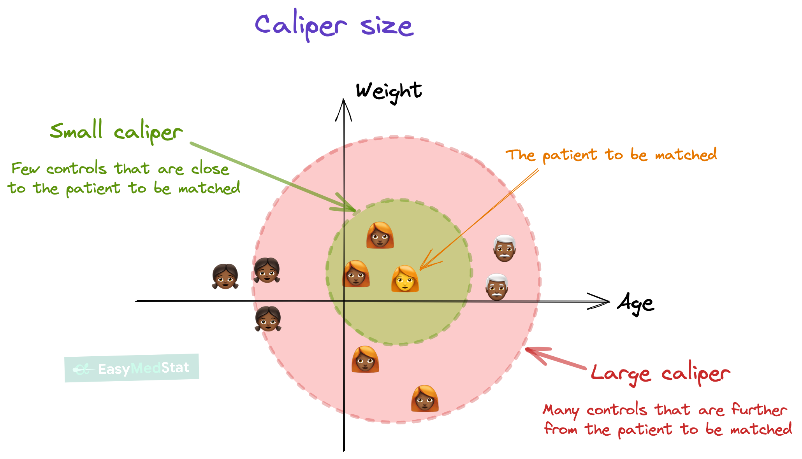

How do we define "closeness" between observaitons is the foundation of matching. The choice of distance metric determines which treated and control units are considered similar enough to compare. This leads to the sample selection to estimate causal effects across treatment assignment. 

For the following distance measures, recognize that the best design are those that best represent perfect stratificaiton of treatment assignment on observable characteristics (and by assumption unobservable characteristics).

# Covariate Selection

Before selecting a distance measure, determine which covariates to include:

**Include:**

- All variables related to **both** treatment assignment **and** outcomes (confounders)
- Pre-treatment characteristics only
- As many relevant covariates as feasible

**Exclude:**

- **Post-treatment variables** (mediators, colliders)
- Variables affected by treatment
- Pure instrumental variables (increases variance without reducing bias)

Selecting on these covariates will be determined by a matching algorithim commonly referred to as a matching method. For each of the subsequent matching methods, you can determine the degree of tolerance between matching across treatment and control units. The diagram visually show how this varies by the caliper size (viz., degree of tolerance). Caliper size has a tradeoff. The smaller the caliper, the closer the match. But larger the caliper, the larger the selection of controls. 

# Coarsened Exact Matching

Two units match exactly if all their covariate values are identical:

$$
D_{ij} = \begin{cases}
0 & \text{if } X_i = X_j \\
\infty & \text{if } X_i \neq X_j
\end{cases}
$$

**When It Works:**

- **Few, discrete covariates** (e.g., race, gender, region)
- **Large sample** with sufficient overlap
- **All covariates categorical** or can be meaningfully discretized

**Limitations:**

- **Curse of dimensionality**: With $p$ covariates each having $k$ levels, there are $k^p$ possible cells
- **Sparsity**: Many cells will be empty or have only treated or only control units
- **Inefficiency**: Discards many observations

# Euclidean Distance

The Euclidean distance is the straight-line distance between two observations in covariate space:

$$
D_{E}(X_i, X_j) = \sqrt{\sum_{k=1}^{p} (X_{ik} - X_{jk})^2}
$$

where $p$ is the number of covariates and $X_{ik}$ is the $k$-th covariate for observation $i$.

**When It Works:**

- **Few covariates** ($p < 10$) with continuous measures
- **Variables on similar scales** (or after standardization: $X_k' = \frac{X_k - \bar{X}_k}{SD(X_k)}$)
- **Straight-line distance intuitive** in problem context
- **Computational simplicity** desired (fast to compute)

**Advantages:**

- **Interpretable**: Direct distance measurement in original covariate space
- **Computationally efficient**: Simple calculation, scales well with sample size
- **Geometric intuition**: Natural interpretation as physical distance
- **No model required**: Unlike propensity scores, requires no estimation step

**Limitations:**

- **Scale-dependent**: Without standardization, covariates with large ranges dominate (e.g., income overwhelms age)
- **Ignores correlations**: Does not account for relationships among covariates
- **Curse of dimensionality**: Distance becomes uninformative with many covariates—all points appear roughly equidistant in high dimensions
- **Not statistically weighted**: Treats all covariates equally regardless of predictive importance

**Standardized Euclidean Distance:**

To address the scale issue, standardize each covariate first:

$$
D_{SE}(X_i, X_j) = \sqrt{\sum_{k=1}^{p} \left(\frac{X_{ik} - X_{jk}}{SD(X_k)}\right)^2}
$$

This is equivalent to the L2 norm in normalized space and is more suitable for matching when covariates have different units.

# Mahalanobis Distance

The Mahalanobis distance accounts for scale and correlation among covariates:

$$
D_{M}(X_i, X_j) = \sqrt{(X_i - X_j)^\top \Sigma^{-1} (X_i - X_j)}
$$

where $\Sigma$ is the covariance matrix of $X$.

## Which Covariance Matrix?

**For ATT (Average Treatment Effect on the Treated):**

$$
\Sigma = \text{Cov}(X | T = 0)
$$

Use covariance from the **control group** only.

**For ATE (Average Treatment Effect):**

$$
\Sigma = \text{Cov}(X | T = 0, T = 1)
$$
Use **pooled** covariance from treated and control groups.

**Properties:**

1. **Scale-invariant**: Variables in different units (age in years, income in dollars) are comparable
2. **Correlation-adjusted**: Accounts for relationships among covariates
3. **Geometric interpretation**: Measures statistical distance in standardized space

**Advantages:**

- Works with **continuous and categorical** variables
- **Robust** to adding irrelevant variables
- No parametric model required (i.e., do not need to assume distribution of errors)

**Limitations:**

- **Assumes multivariate normality** (implicitly)
- **Sensitive to dimensionality**: Performance degrades with many covariates
- **Collinearity issues**: If $\Sigma$ is singular, inverse does not exist

# Propensity Score Distance

The **propensity score** is the conditional probability of treatment:

$$
e(X) = P(T = 1 | X)
$$

Distance based on propensity scores:

$$
D_{PS}(X_i, X_j) = |e(X_i) - e(X_j)|
$$

**The Balancing Property:**

@rosenbaum1983central proved that conditioning on $e(X)$ is equivalent to conditioning on $X$:

$$
X \perp T | e(X)
$$

This means at each propensity score value, the distribution of $X$ is the same in treated and control groups.

## Estimation

**Logistic Regression:**

Most commonly this is estimated using a logit:

$$
\log \left( \frac{e(X)}{1 - e(X)} \right) = X^\top \beta
$$

**Machine Learning Methods:**

But there is increasing use a machine learning techniques to estimate the propensity score. Machine learning is a useful applicaiton in this setting as we would like to condense a large variation of information into a single predictive score. Machine learning techniquese are extreme useful at predicting outcomes using a large set of information (e.g., big data).

- **LASSO Regularization**: Applies $L1$ penalty to linear models to perform automatic variable selection, shrinking coefficients of irrelevant predictors to zero while estimating treatment probabilities with reduced dimensionality.
- **Generalized Boosted Models (GBM)**: Iteratively builds an ensemble of weak learners (typically trees) to minimize prediction error, effectively capturing nonlinear relationships and interactions in treatment assignment.
- **Random Forests**: Aggregates predictions from multiple decision trees trained on random subsets of data and features, providing robust propensity score estimation with built-in feature importance measures.
- **Neural Networks**: Uses interconnected layers of nonlinear activation functions to learn complex, high-dimensional relationships between covariates and treatment assignment, particularly useful with large covariate sets.

# Logit Propensity Score Distance

As an alternative to a propensity score, you may transform propensity scores to logit scale:

$$
D_{\text{logit}}(X_i, X_j) = |\text{logit}(e(X_i)) - \text{logit}(e(X_j))|
$$

where:

$$
\text{logit}(e) = \log \left( \frac{e}{1 - e} \right)
$$

**Why Use Logit Scale?**

1. **Unbounded**: Maps $(0, 1) \rightarrow (-\infty, \infty)$
2. **More stable in tails**: Small differences near 0 or 1 are magnified
3. **Symmetric**: Equal weighting to low and high propensity scores

# Comparison of Distance Measures

| **Method** | **Formula** | **Pros** | **Cons** |
|------------|-------------|----------|----------|
| Exact | $X_i = X_j$ | Perfect balance | Only for discrete $X$, sparse |
| Mahalanobis | $(X_i - X_j)^\top \Sigma^{-1} (X_i - X_j)$ | Scale-invariant, multivariate | High-dimensional issues |
| Propensity Score | $\|e(X_i) - e(X_j)\|$ | Dimension reduction | Model-dependent |
| Logit PS | $\|\text{logit}(e(X_i)) - \text{logit}(e(X_j))\|$ | Better tail behavior | Model-dependent |

# References

::: {#refs}
:::
